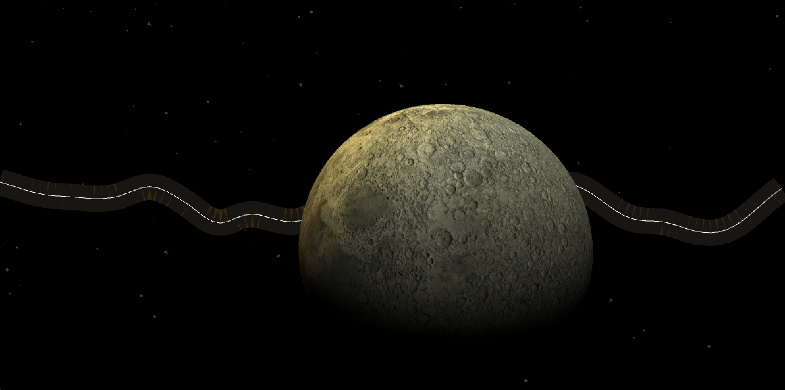

## Final Project: Synesthetic Instrument
> NOTE: the `assets` folder only contains screenshots of the project and is not part of the project code.

I knew I wanted to create an instrument that used OpenCV's facial detection features, and was initially planning to use the mouth detection to build sound around the movement and opening of a mouth. Unfortunately, the OpenCV library as-is was detecting multiple mouths every time the camera opened, and in order to not completely derail my project with the time we had, I chose to use the more reliable "frontal face" detection.

I knew I wanted to artificially set and use a `z` value with the face detection to simulate a depth camera, then map that to a sound manipulation, but with 2D primitives the visual was not as successful as I would have liked. I decided to use a sphere shape (which introduced bugs with OpenCV, which is not as compatible with `P3D`), and once I saw how it looked my final visuals began to come into place. 

I chose to create a space theme, using the facial detection -rendered sphere to manipulate a sine wave cluster. I mapped the `x`, `y,`, and `z` of the sphere to various sound manipulations, and added a soundwave visualization to create a "rings around a planet" effect (maybe the moon has rings in this sonic universe!)

I wanted to create a Milky Way-esque path of stars along my soundwave graphic, however I am not as comfortable with `translate()` and I think my path ended up offscreen because of the translations elsewhere in my project. Given the time alloted to this project, I chose to consider it "done" where I landed, but am eager to revisit and get these visual elements, as well as the sound elements, to a stronger place.

See a demo of the project on [Vimeo](https://vimeo.com/manage/videos/656281402)

### Code Cited
"adapted" code used as a starting point and developed off of
1. Base sound functionality adapted from Processing Sound Library, Example 1 (https://processing.org/tutorials/sound)
1. Waveform graphic adapted from `Processing Examples > Sound > Waveform`
1. Face Detection adapted from `Processing Examples > OpenCV > FaceDetection`
1. Moon texture from [Pixel Planet Emporium](http://planetpixelemporium.com/)
1. "Notes" code adapted from `Processing Examples > Sound > Env > Envelopes`
1. Path Following (mostly unsuccessfully) adapted from _The Nature of Code_ by Daniel Shiffman, Path Following examples
1. The Coding Train's "Starfield" example inspired the background stars (https://github.com/CodingTrain/website/blob/main/CodingChallenges/CC_001_StarField)

