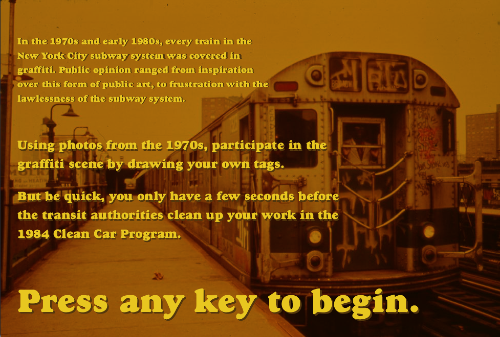
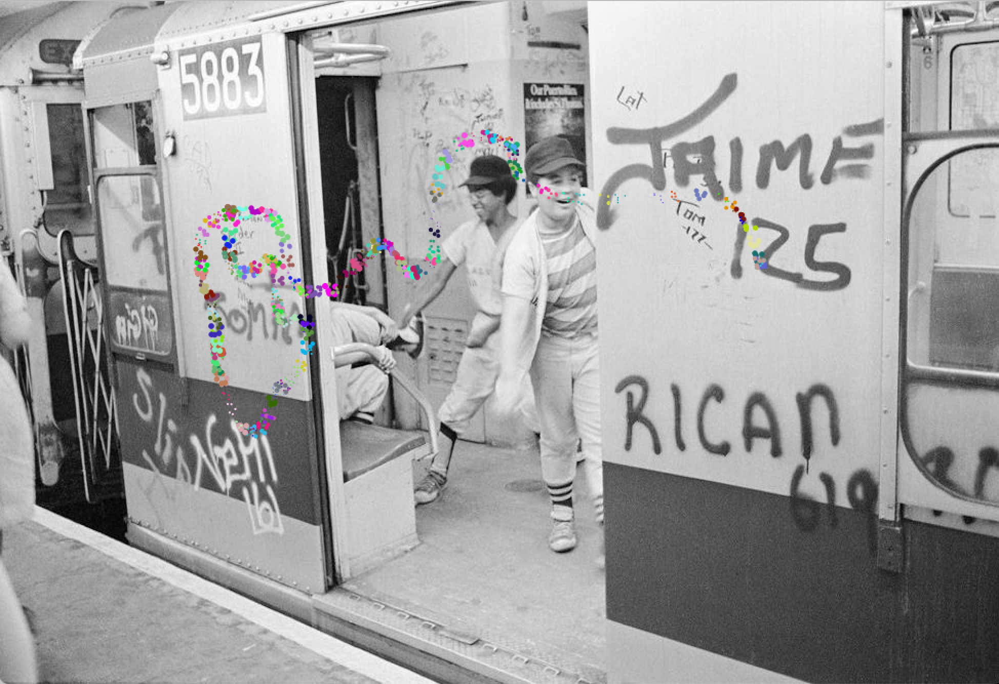
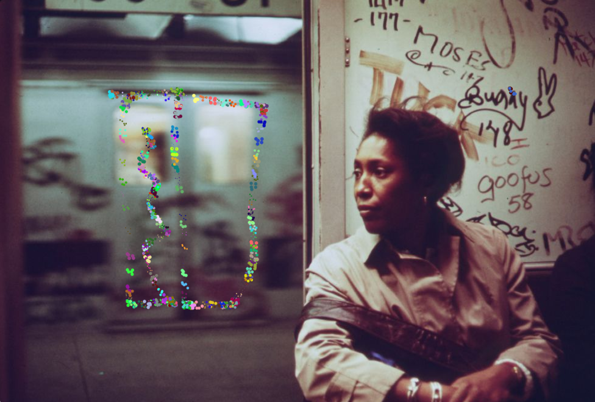

# Lab 1: Drawing

## Project description
For this lab I tried to consider spaces where drawing was seen as crude, unwelcome, or an act of rebellion. I wanted to explore "ruining" something with my drawing.

Based on my limited skills with Processing, this meant drawing over photographs. I chose imagery of the New York City subway system in the 1970s and early 1980s, then built a program to draw over the images.

I then wanted to extend the program into a mini game to see what was possible with just a week of Processing learning. I build a splash page for the game's "load screen", then created a timer to reset the background image after a certain number of seconds.

If this lab had a larger scope, I would have loved to display my timer, and maybe have some kind of goal for the user at each "level" but for the skills I have now, I'm satisfied with the environment I created around the concept of drawing.

## Screenshots

Splash screen

Drawing on the images

Drawing on the images
