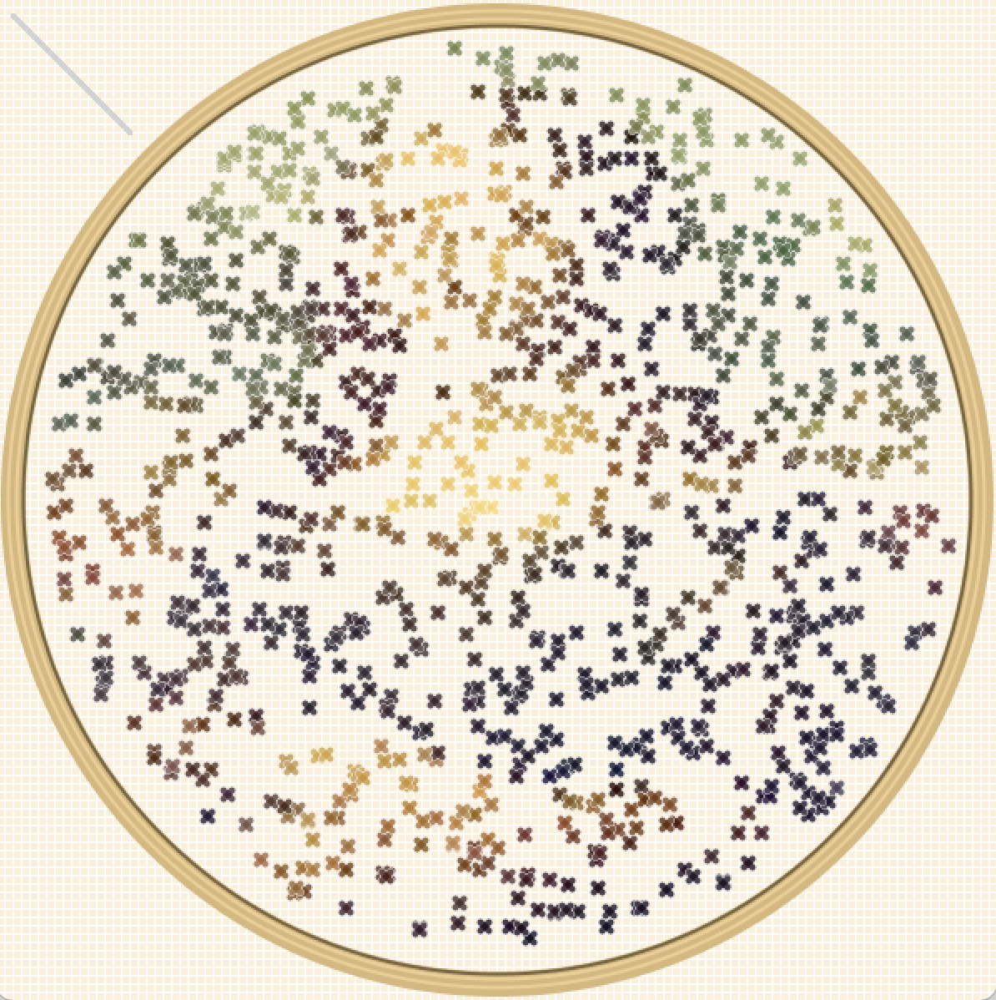
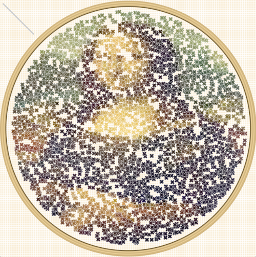

## Project 3: Custom Pixel
> NOTE: the `assets` folder only contains screenshots of the project and is not part of the project code

Adapted the [Pointilism Example from _Learning Processing_](http://learningprocessing.com/examples/chp15/example-15-14-Pointillism) to create a cross-stitch custom pixel. Customizations include the stitch concept and shape, adding a z-value for the stitches, and creating an embroidery hoop with a circular boundary to contain the stitches. 

Future improvements would include adding a sewing needle, perhaps even making it interactive.

### Code Cited
1. Drawing a shape from the colour value of a pixel in a (not-displayed) image comes from the Pointilism Example from _Learning Processing_.
(http://learningprocessing.com/examples/chp15/example-15-14-Pointillism)

1. Boundary for circle is from Pythagoras, but referenced generic formula online, e.g.,
(https://stackoverflow.com/questions/481144/equation-for-testing-if-a-point-is-inside-a-circle)

