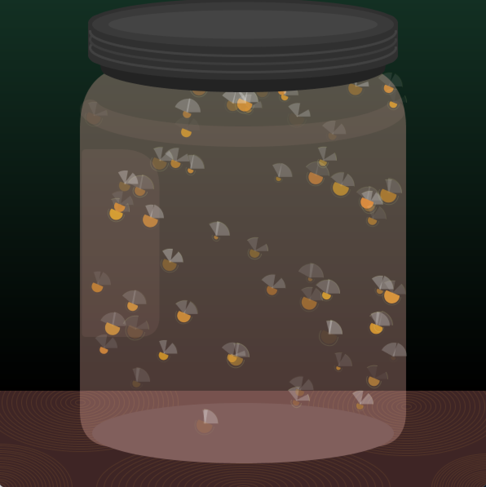

# EECS 1710 Work

## [Project 1: Creature](https://github.com/inarticulatetheory/EECS1710-michelle/tree/main/Project_1C)
Fireflies trapped in a jar. Over time the fireflies begin to die, losing their glow and falling to the bottom of the jar.
 

## [Lab 1: Drawing](https://github.com/inarticulatetheory/EECS1710-michelle/tree/main/Lab%201)
Drawing "graffiti" on the New York subway system of the 1970s.
 

