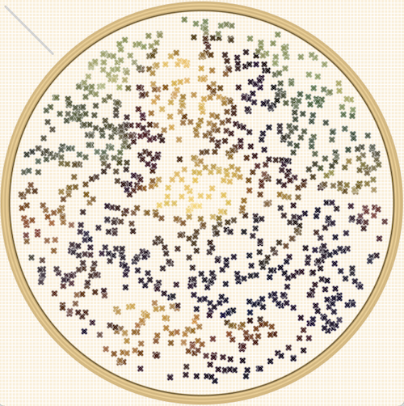

# EECS 1710 Work

## [Final Project: Synesthetic Instrument](/FinalProject_SynaestheticInstrument) 
### [Demo Video](https://vimeo.com/manage/videos/656281402)
An instrument that manipulates a sine wave cluster through a moon avatar controlled by your face. As you move your face, the moon will match your movement, applying effects to the underlying sound based on the horizontal, vertical, or depth movement of the moon. A waveform will graphically output as you create sound, while stars, comets, and space junk serve as your distant audience.

## [Project 3: Custom Pixel](/Project3_CustomPixel)
Adapted the [Pointilism Example from _Learning Processing_](http://learningprocessing.com/examples/chp15/example-15-14-Pointillism) to create a cross-stitch custom pixel. Customizations include the stitch concept and shape, adding a z-value for the stitches, and creating an embroidery hoop with a circular boundary to contain the stitches. With more time would also add a sewing needle, perhaps even making it interactive.

## [Exercise 4: Alphabet](/Exercise4_Alphabet)
Adapted Jordan Schiffman's [Crowd Pathing Example](https://github.com/nature-of-code/noc-examples-processing/tree/master/chp06_agents/Exercise_6_13_CrowdPathFollowing) from _The Nature of Code_ to build a swimming school of fish following the path of an alphabet letter. To add to the environment, other fish float by in the background, and bubbles rise. Within the time available, only completed "A" as a hard-coded letter, but would expand to include a `Letters` class with more time.

## [Midterm: One-Button Game](/Midterm_Project_Game)
### [Demo Video](https://vimeo.com/manage/videos/638781106)
Create the terrible, sad, and angsty poetry of your teenage years! Generates a poem constructed by popping word balloons with a tear. Each balloon represents one of 4000 possible word choices. Collaborate with the randomness of the program by stringing together logical sentence patterns and waiting to see the terrible poetry you can write. As words are added to the poem, they appear in the background as "constellations," adding to the absurd dream-like world of the game.

## [Project 1: Creature](/Project1_Creature)
Fireflies trapped in a jar. Over time the fireflies begin to die, losing their glow and falling to the bottom of the jar.
 

## [Exercise 2: Landscape](https://github.com/inarticulatetheory/EECS1710-michelle/tree/main/Exercise2_Landscape)
Landscape driving toward a vanishing point. Navigating the change in perspective with my vanishing point was a challenge, and the math isn't quite completely visually tight.
Unfortunately my landscape began encountering a Java runtime error, but troubleshooting will be an ongoing process.

## [Exercise 1: Drawing](https://github.com/inarticulatetheory/EECS1710-michelle/tree/main/Exercise1_Drawing)
Drawing "graffiti" on the New York subway system of the 1970s.
 

